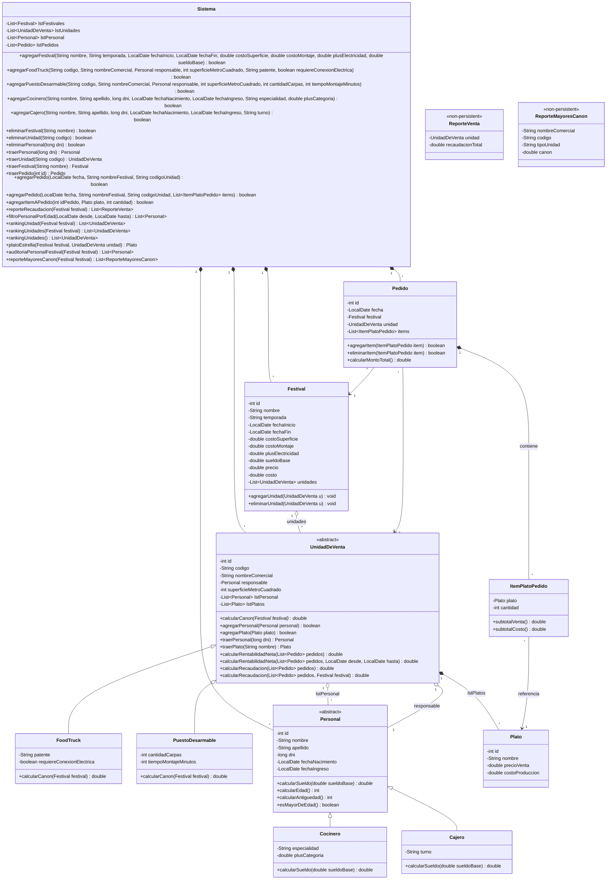

```mermaid
classDiagram

class Sistema {
    -List~Festival~ lstFestivales
    -List~UnidadDeVenta~ lstUnidades
    -List~Personal~ lstPersonal
    -List~Pedido~ lstPedidos
    +agregarFestival(String nombre, String temporada, LocalDate fechaInicio, LocalDate fechaFin, double costoSuperficie, double costoMontaje, double plusElectricidad, double sueldoBase) boolean
    +agregarFoodTruck(String codigo, String nombreComercial, Personal responsable, int superficieMetroCuadrado, String patente, boolean requiereConexionElectrica) boolean
    +agregarPuestoDesarmable(String codigo, String nombreComercial, Personal responsable, int superficieMetroCuadrado, int cantidadCarpas, int tiempoMontajeMinutos) boolean
    +agregarCocinero(String nombre, String apellido, long dni, LocalDate fechaNacimiento, LocalDate fechaIngreso, String especialidad, double plusCategoria) boolean
    +agregarCajero(String nombre, String apellido, long dni, LocalDate fechaNacimiento, LocalDate fechaIngreso, String turno) boolean
    +eliminarFestival(String nombre) boolean
    +eliminarUnidad(String codigo) boolean
    +eliminarPersonal(long dni) boolean
    +traerPersonal(long dni) Personal
    +traerUnidad(String codigo) UnidadDeVenta
    +traerFestival(String nombre) Festival
    +traerPedido(int id) Pedido
    +agregarPedido(LocalDate fecha, String nombreFestival, String codigoUnidad) boolean
    +agregarPedido(LocalDate fecha, String nombreFestival, String codigoUnidad, List~ItemPlatoPedido~ items) boolean
    +agregarItemAPedido(int idPedido, Plato plato, int cantidad) boolean
    +reporteRecaudacion(Festival festival) List~ReporteVenta~
    +filtroPersonalPorEdad(LocalDate desde, LocalDate hasta) List~Personal~
    +rankingUnidad(Festival festival) List~UnidadDeVenta~
    +rankingUnidades(Festival festival) List~UnidadDeVenta~
    +rankingUnidades() List~UnidadDeVenta~
    +platoEstrella(Festival festival, UnidadDeVenta unidad) Plato
    +auditoriaPersonalFestival(Festival festival) List~Personal~
    +reporteMayoresCanon(Festival festival) List~ReporteMayoresCanon~
}

class Festival {
    -int id
    -String nombre
    -String temporada
    -LocalDate fechaInicio
    -LocalDate fechaFin
    -double costoSuperficie
    -double costoMontaje
    -double plusElectricidad
    -double sueldoBase
    -double precio
    -double costo
    -List~UnidadDeVenta~ unidades
    +agregarUnidad(UnidadDeVenta u) void
    +eliminarUnidad(UnidadDeVenta u) void
}

class UnidadDeVenta {
    <<abstract>>
    -int id
    -String codigo
    -String nombreComercial
    -Personal responsable
    -int superficieMetroCuadrado
    -List~Personal~ lstPersonal
    -List~Plato~ lstPlatos
    +calcularCanon(Festival festival) double*
    +agregarPersonal(Personal personal) boolean
    +agregarPlato(Plato plato) boolean
    +traerPersonal(long dni) Personal
    +traerPlato(String nombre) Plato
    +calcularRentabilidadNeta(List~Pedido~ pedidos) double
    +calcularRentabilidadNeta(List~Pedido~ pedidos, LocalDate desde, LocalDate hasta) double
    +calcularRecaudacion(List~Pedido~ pedidos) double
    +calcularRecaudacion(List~Pedido~ pedidos, Festival festival) double
}

class FoodTruck {
    -String patente
    -boolean requiereConexionElectrica
    +calcularCanon(Festival festival) double
}

class PuestoDesarmable {
    -int cantidadCarpas
    -int tiempoMontajeMinutos
    +calcularCanon(Festival festival) double
}

class Personal {
    <<abstract>>
    -int id
    -String nombre
    -String apellido
    -long dni
    -LocalDate fechaNacimiento
    -LocalDate fechaIngreso
    +calcularSueldo(double sueldoBase) double*
    +calcularEdad() int
    +calcularAntiguedad() int
    +esMayorDeEdad() boolean
}

class Cocinero {
    -String especialidad
    -double plusCategoria
    +calcularSueldo(double sueldoBase) double
}

class Cajero {
    -String turno
    +calcularSueldo(double sueldoBase) double
}

class Plato {
    -int id
    -String nombre
    -double precioVenta
    -double costoProduccion
}

class ItemPlatoPedido {
    -Plato plato
    -int cantidad
    +subtotalVenta() double
    +subtotalCosto() double
}

class Pedido {
    -int id
    -LocalDate fecha
    -Festival festival
    -UnidadDeVenta unidad
    -List~ItemPlatoPedido~ items
    +agregarItem(ItemPlatoPedido item) boolean
    +eliminarItem(ItemPlatoPedido item) boolean
    +calcularMontoTotal() double
}

class ReporteVenta {
    <<non-persistent>>
    -UnidadDeVenta unidad
    -double recaudacionTotal
}

class ReporteMayoresCanon {
    <<non-persistent>>
    -String nombreComercial
    -String codigo
    -String tipoUnidad
    -double canon
}

%% Relaciones
Sistema "1" *-- "*" Festival
Sistema "1" *-- "*" UnidadDeVenta
Sistema "1" *-- "*" Personal
Sistema "1" *-- "*" Pedido

Festival "1" o-- "*" UnidadDeVenta : unidades

UnidadDeVenta <|-- FoodTruck
UnidadDeVenta <|-- PuestoDesarmable
Personal <|-- Cocinero
Personal <|-- Cajero

UnidadDeVenta "1" o-- "*" Personal : lstPersonal
UnidadDeVenta "1" o-- "1" Personal : responsable
UnidadDeVenta "1" *-- "*" Plato : lstPlatos

Pedido "*" --> "1" Festival
Pedido "*" --> "1" UnidadDeVenta
Pedido "1" *-- "*" ItemPlatoPedido : contiene
ItemPlatoPedido "*" --> "1" Plato : referencia
```