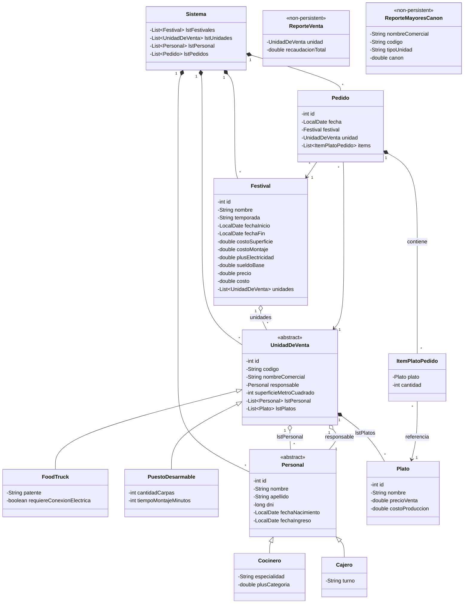

```mermaid
classDiagram

class Sistema {
    -List~Festival~ lstFestivales
    -List~UnidadDeVenta~ lstUnidades
    -List~Personal~ lstPersonal
    -List~Pedido~ lstPedidos
}

class Festival {
    -int id
    -String nombre
    -String temporada
    -LocalDate fechaInicio
    -LocalDate fechaFin
    -double costoSuperficie
    -double costoMontaje
    -double plusElectricidad
    -double sueldoBase
    -double precio
    -double costo
    -List~UnidadDeVenta~ unidades
}

class UnidadDeVenta {
    <<abstract>>
    -int id
    -String codigo
    -String nombreComercial
    -Personal responsable
    -int superficieMetroCuadrado
    -List~Personal~ lstPersonal
    -List~Plato~ lstPlatos
}

class FoodTruck {
    -String patente
    -boolean requiereConexionElectrica
}

class PuestoDesarmable {
    -int cantidadCarpas
    -int tiempoMontajeMinutos
}

class Personal {
    <<abstract>>
    -int id
    -String nombre
    -String apellido
    -long dni
    -LocalDate fechaNacimiento
    -LocalDate fechaIngreso
}

class Cocinero {
    -String especialidad
    -double plusCategoria
}

class Cajero {
    -String turno
}

class Plato {
    -int id
    -String nombre
    -double precioVenta
    -double costoProduccion
}

class ItemPlatoPedido {
    -Plato plato
    -int cantidad
}

class Pedido {
    -int id
    -LocalDate fecha
    -Festival festival
    -UnidadDeVenta unidad
    -List~ItemPlatoPedido~ items
}

class ReporteVenta {
    <<non-persistent>>
    -UnidadDeVenta unidad
    -double recaudacionTotal
}

class ReporteMayoresCanon {
    <<non-persistent>>
    -String nombreComercial
    -String codigo
    -String tipoUnidad
    -double canon
}

%% Relaciones
Sistema "1" *-- "*" Festival
Sistema "1" *-- "*" UnidadDeVenta
Sistema "1" *-- "*" Personal
Sistema "1" *-- "*" Pedido

Festival "1" o-- "*" UnidadDeVenta : unidades

UnidadDeVenta <|-- FoodTruck
UnidadDeVenta <|-- PuestoDesarmable
Personal <|-- Cocinero
Personal <|-- Cajero

UnidadDeVenta "1" o-- "*" Personal : lstPersonal
UnidadDeVenta "1" o-- "1" Personal : responsable
UnidadDeVenta "1" *-- "*" Plato : lstPlatos

Pedido "*" --> "1" Festival
Pedido "*" --> "1" UnidadDeVenta
Pedido "1" *-- "*" ItemPlatoPedido : contiene
ItemPlatoPedido "*" --> "1" Plato : referencia
```
